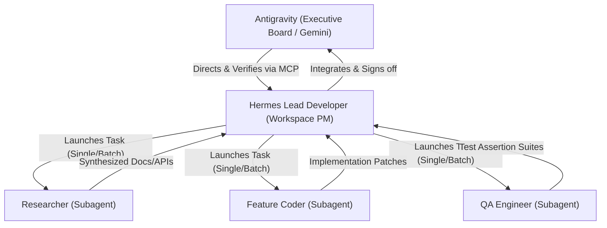
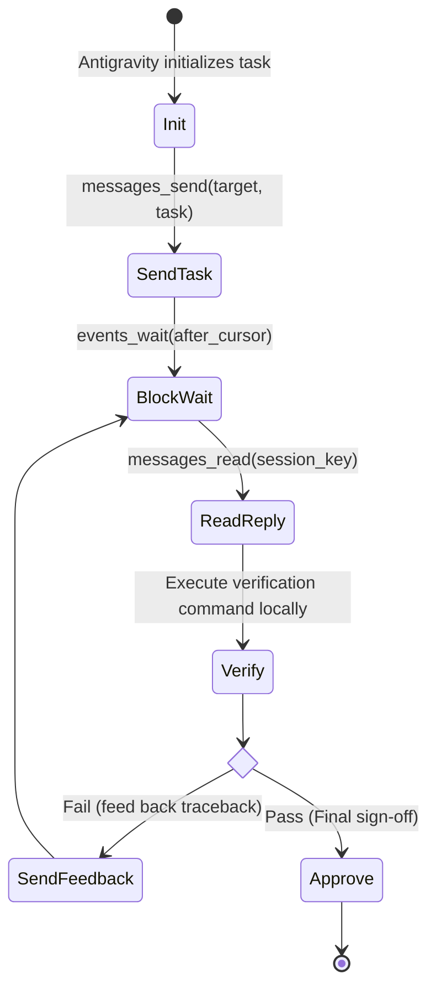

# HAM-TDD: Hierarchical Delegation & MCP Integration Specification

This specification outlines the multi-agent collaboration framework between **Antigravity (Google Gemini)** as the Executive Coordinator and **Hermes (Nous Research)** as the Workspace Implementation Lead, utilizing Hermes's out-of-the-box Model Context Protocol (MCP) server.

---

## 1. System Architecture Overview

To achieve highly complex tasks without overwhelming the main context window of the coordinating model (Gemini), the system is divided into a three-tier corporate hierarchy:



### Roles & Responsibilities
1. **Executive Board (Antigravity/Gemini):** Holds the high-level project vision. Handles complex reasoning, architectural design, reviews the final workspace state, and executes verification tests. Does not touch the filesystem directly; delegates all executions to Hermes.
2. **Lead Developer / Workspace PM (Primary Hermes Session):** Exposes an MCP interface to Antigravity. Receives goals, devises the execution strategy, manages dependencies, coordinates subagents, merges code, and resolves integration conflicts.
3. **Specialized Worker Subagents (Hermes Subagents):** Short-lived, task-focused leaf agents spawned by the Hermes PM to execute specific tasks.

---

## 2. Antigravity-to-Hermes Communication: The MCP Bridge

Hermes Agent ships with an out-of-the-box, stdio-compatible MCP server. When running `hermes mcp serve`, it exposes a **10-tool messaging and control surface** that matches OpenClaw's channel bridge. Antigravity connects to this server to talk to Hermes and drive the session.

### The 10 Out-of-the-Box MCP Tools

| Tool Name | Parameters | Return Schema | Purpose |
|:---|:---|:---|:---|
| **`conversations_list`** | `platform` (opt), `limit` (opt), `search` (opt) | `{"count": int, "conversations": [...]}` | Lists active Hermes messaging channels/sessions with their `session_key` and `session_id`. |
| **`conversation_get`** | `session_key` (req) | `{"session_key": str, "session_id": str, "platform": str, ...}` | Retrieves detailed metadata, token stats, and platform routing info for a target session. |
| **`messages_read`** | `session_key` (req), `limit` (opt) | `{"session_key": str, "messages": [{"role", "content", "timestamp"}]}` | Reads chronological transcript history from a specific Hermes session. |
| **`attachments_fetch`** | `session_key` (req), `message_id` (req) | `{"message_id": str, "attachments": [...]}` | Extracts non-text media objects (images, data payloads) from a message. |
| **`events_poll`** | `after_cursor` (opt), `session_key` (opt), `limit` (opt) | `{"events": [...], "next_cursor": int}` | Non-blocking poll for new workspace events (messages, approvals). |
| **`events_wait`** | `after_cursor` (opt), `session_key` (opt), `timeout_ms` (opt) | `{"event": {...}}` or `{"event": null, "reason": "timeout"}` | Long-poll blocks until Hermes issues a message or request, allowing real-time turn detection. |
| **`messages_send`** | `target` (req), `message` (req) | `{"success": bool, "message_id": str}` | Submits a task instruction or feedback string to a Hermes target session. |
| **`channels_list`** | None | `{"channels": [...]}` | Scans and lists all active chat routes and available physical platforms. |
| **`permissions_list_open`**| None | `{"requests": [...]}` | Lists active manual approval gates triggered by Hermes's security manager. |
| **`permissions_respond`** | `request_id` (req), `action` (req) | `{"success": bool}` | Dynamically approves (`allow`) or rejects (`deny`) pending shell actions. |

---

## 3. Hermes-to-Subagent Delegation: `delegate_task`

The Hermes Lead Developer (Workspace PM) uses its built-in `delegate_task` tool to split complex tasks into highly focused subtasks. This isolates code files, terminals, and dependencies, keeping the Lead PM's context window extremely clean.

### The `delegate_task` Tool Schema

`delegate_task` can run in **Single mode** or **Batch mode** (up to 3 concurrent tasks):

```json
{
  "name": "delegate_task",
  "parameters": {
    "goal": "Specific objective for the subagent",
    "context": "File paths, error traces, specs, API details, and constraints",
    "role": "leaf",
    "toolsets": ["terminal", "file", "web", "search"],
    "tasks": [
      {
        "goal": "Goal for task 1",
        "context": "Context for task 1",
        "toolsets": ["web", "search"]
      },
      {
        "goal": "Goal for task 2",
        "context": "Context for task 2",
        "toolsets": ["terminal", "file"]
      }
    ]
  }
}
```

### Implementing the Corporate Roles

When the Lead Hermes PM receives an architectural requirement from Antigravity, it executes a batch delegation to its subagents:

1. **Researcher Subagent:**
   * **Goal:** "Query external sources for API specifications or best practices."
   * **Toolsets:** `["web", "search"]` (No filesystem access needed; pure intelligence).
2. **Feature Coder Subagent:**
   * **Goal:** "Implement the functional changes described in the specification inside the workspace."
   * **Toolsets:** `["terminal", "file"]` (Direct local file modification and linting).
3. **QA Engineer Subagent:**
   * **Goal:** "Draft comprehensive unit/integration test suites to assert all edge-cases."
   * **Toolsets:** `["terminal", "file"]` (Writes testing scripts and executes them).

---

## 4. The Interactive HAM-TDD Loop Protocol

The collaboration follows a strict Test-Driven Development feedback state machine driven by Antigravity:



### State Protocol

1. **Initialization:** Antigravity connects to Hermes's stdio server via the `SimpleMCPClient` and calls `conversations_list` to fetch the workspace `session_key`.
2. **Task Instruction:** Antigravity calls `messages_send` to inject the design goals, functional specification, and expected files.
3. **Lead Processing:** Hermes's PM receives the goal, orchestrates subagents via `delegate_task` (parallelized research, coding, and testing), aggregates their work, merges code in the workspace, and returns a consolidated implementation report.
4. **Execution Monitoring:** Antigravity calls `events_wait` to block-wait for Hermes's response. When a message event is received, it calls `messages_read` to fetch the full response.
5. **Outer Verification Loop:** 
   * Antigravity triggers the verification command (e.g. `pytest tests/`) inside the workspace.
   * **If tests fail:** Antigravity captures the full traceback and uses `messages_send` to deliver it to Hermes's session, starting the next round.
   * **If tests pass:** Antigravity issues a final sign-off message (`Verification passed successfully!`), prompting Hermes to save any newly learned workflows as a permanent **Skill** (`skill_manage`), and gracefully shuts down the session.

---

## 5. Key Context & Memory Best Practices

* **Zero Memory Leakage:** Subagents spawned via `delegate_task` are completely ephemeral and discard intermediate token history, preventing the parent workspace PM from bloating.
* **Persistent Workflows:** If Hermes encounters a tricky bug or discovers a non-trivial platform configuration, it will write a permanent skill markdown file using `skill_manage` to `~/.hermes/skills/` so future sessions inherit this procedural knowledge instantly.
* **Hermes State Database Preservation:** Ensure `HERMES_SESSION_SOURCE` is set to `tui` so all interactions are mapped perfectly in the Hermes desktop logs and state DB, maintaining full auditability.
