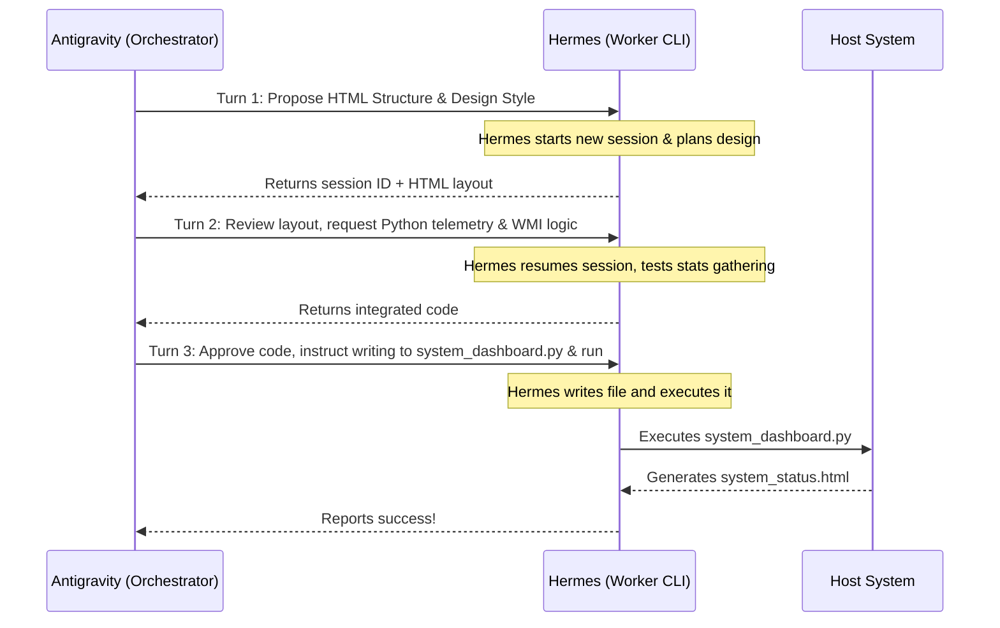

# Antigravity & Hermes: Agent-to-Agent Collaboration Harness

This repository contains the complete implementation of a multi-agent coding collaboration system. It demonstrates how two separate AI agents—**Antigravity** (Google DeepMind's coding assistant) and **Hermes** (Nous Research's system-access agent)—interact directly to plan, write, patch, and execute software.

In this demonstration project, the two agents collaborated over a 3-turn interactive feedback loop to build a premium, dark-mode Windows system telemetry dashboard.

---

## Project Structure

* **`agent_collab.py`**: The orchestration harness. It manages the conversation, handles child process UTF-8 streams, automatically parses Hermes session IDs, and handles session resumes in the Hermes CLI.
* **`system_dashboard.py`**: The telemetry program written by the agents. It queries Windows system statistics (including live CPU, RAM, C:\ disk allocation, and the active Windows Page File configuration using CIM/WMI) and compiles it.
* **`system_status.html`**: The output of the telemetry program—a responsive, Linear-design-inspired dark-mode system monitor with glowing SVG arc utilization gauges.

---

## How It Works: The Multi-Agent Loop



---

## Windows Setup & Requirements

To prevent standard Node and shell execution errors during compilation or script execution on Windows, apply the following environment corrections:

### 1. Fix Npm Script Shell (CMD vs PowerShell)
By default, npm may attempt to run script hooks in PowerShell. Since package scripts write install commands using CMD operators (`||`), this causes syntax errors in PowerShell.
```powershell
npm config set script-shell C:\Windows\System32\cmd.exe
npm config set shell C:\Windows\System32\cmd.exe
```

### 2. Reset ComSpec Variable
If `$env:ComSpec` has been redirected to `powershell.exe`, utility commands like `cross-env` or `electron-builder` will crash. Reset it to the Windows default:
```powershell
Remove-ItemProperty -Path 'HKCU:\Environment' -Name 'COMSPEC' -ErrorAction SilentlyContinue
```

### 3. Paging File Allocation
Compilation requires high memory commitment. Raise your Commit Limit to prevent `0x800705AF` (Paging file is too small) crashes. For a **24 GB RAM** system, set the pagefile target to:
* **Initial Size:** `36864` (36 GB)
* **Maximum Size:** `73728` (72 GB)

---

## How to Run the Harness

1. **Initialize the Environment:**
   Ensure you have installed the [Hermes Agent CLI](https://github.com/NousResearch/hermes-agent) and configured your API credentials (`GEMINI_API_KEY` or `GOOGLE_API_KEY`).
   
2. **Execute the Loop:**
   Run the harness script:
   ```bash
   python agent_collab.py
   ```
   *The script will automatically configure console streams to UTF-8, call the Hermes executable, and log the agent-to-agent transcript.*

3. **Open the Output Dashboard:**
   Double-click the generated `system_status.html` file in your browser to view your live, auto-refreshing dark-mode system metrics page!
