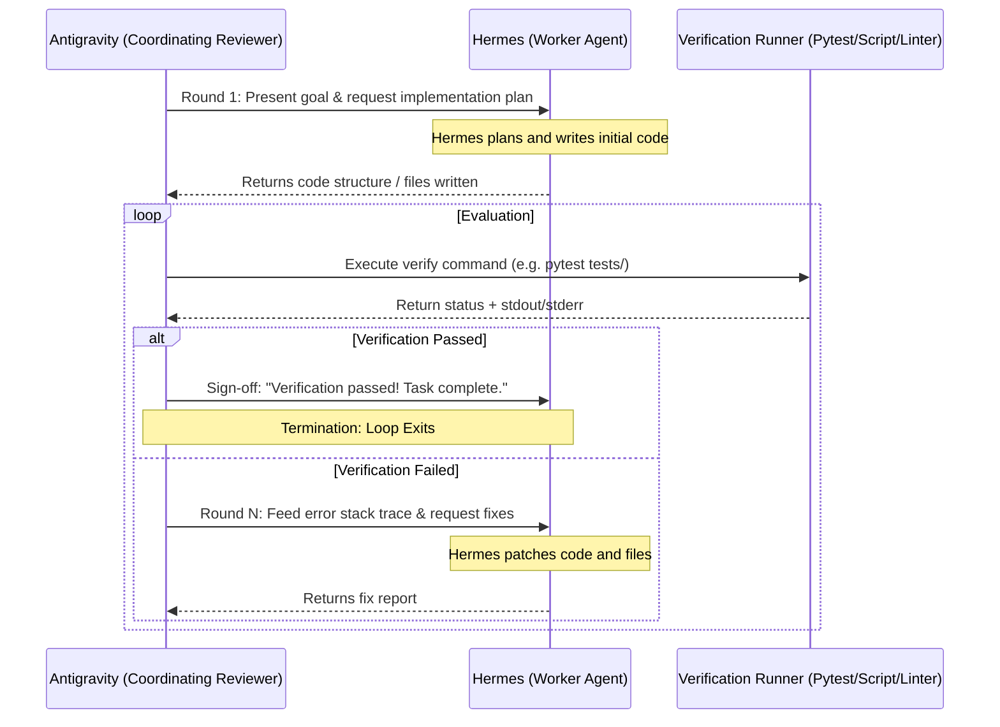
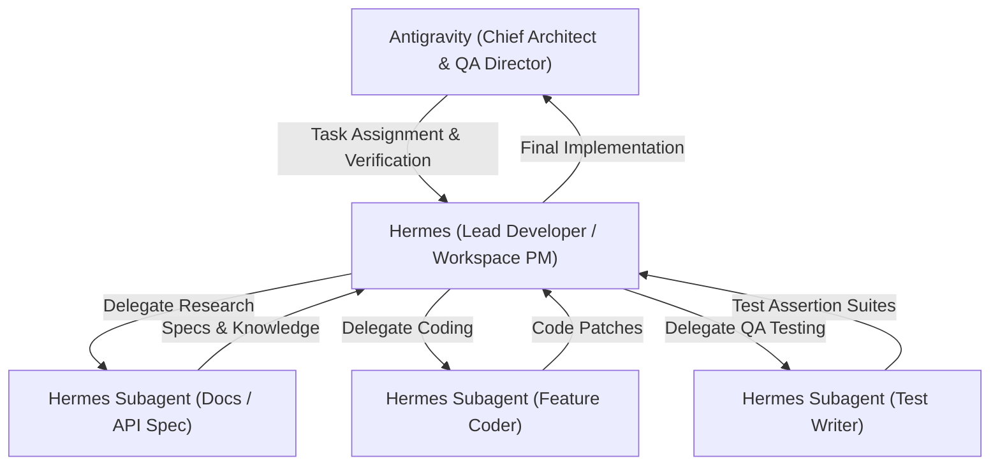

# HAM-TDD: Hermes & Antigravity Multi-Agent Test-Driven Development Framework

HAM-TDD is a task-agnostic, multi-agent collaboration framework that enables **Antigravity** (Google DeepMind's coding assistant) and **Hermes** (Nous Research's system-access agent) to collaboratively implement and verify software using Test-Driven Development (TDD).

Instead of target-specific code, this framework provides a general-purpose orchestration harness (`harness.py`) that drives Hermes to complete **any** user-defined task, executing verification checks in a loop until the tests pass.

---

## How It Works: The TDD Feedback Loop



---

## Hierarchical Delegation & Corporate Structure

To tackle complex tasks efficiently without overflowing the primary agent's context window, HAM-TDD supports a hierarchical corporate delegation pattern:



### Roles and Responsibilities
* **Executive Board (Antigravity):** Directs the overall project, defines high-level architectural constraints, runs validation suites, and serves as the final sign-off gatekeeper.
* **Lead Developer (Primary Hermes Session):** Manages the physical workspace, resolves module dependencies, integrates components, and coordinates worker subagents.
* **Specialized Worker Subagents:**
  * **Researcher:** Crawls docs and search results, returning synthesized facts to keep the lead developer's context window clean.
  * **Feature Coder:** Focuses entirely on writing modular implementation code to match specs.
  * **QA Engineer:** Focuses on writing mock test suites and discovering edge cases to verify implementation logic.

---

## Features

* **Task-Agnostic Execution:** Works for any language or script—simply specify a goal and a shell verification command (e.g. unit tests, linters, compilation steps).
* **Automatic Error Feedback:** If the verification command fails, the harness automatically captures the exact terminal error output and feeds it directly back to Hermes' session for automated patching.
* **Hermes Session Tracking:** Automatically strips ANSI colors and parses stdout/stderr to track and resume Hermes CLI sessions across execution rounds.
* **Native MCP Collaboration & Auto-Approval:** Communicates with Hermes's built-in stdio MCP server (`hermes mcp serve`) for clean markdown data exchange, while automatically monitoring and approving security-gated commands on the fly.
* **Process Env Safety:** Bypasses Windows-specific shell crashes by forcing standard `ComSpec` (`cmd.exe`) variables in child processes.
* **Persistent Logs:** Every agent-to-agent transcript and verification result is logged under `collab_logs/collaboration_transcript.log`.

---

## Setup & Environment

Ensure you have your environment variables set (`GEMINI_API_KEY` or `GOOGLE_API_KEY` for Google Gemini models) and your npm execution shell settings configured correctly as described in [install-hermes-desktop](file:///C:/Users/admin/AppData/Local/hermes/skills/devops/install-hermes-desktop/SKILL.md).

---

## How to Run

Launch the harness by specifying a task and an optional verification command:

```bash
python harness.py --task "Implement a Python function in fib.py that computes Fibonacci numbers, and add unit tests" --verify "pytest fib.py"
```

### CLI Arguments
* `--task`: **(Required)** The description of the goal you want the agents to achieve.
* `--verify`: Optional shell command to run to verify task completion (e.g., `pytest`, `npm test`, `python test.py`).
* `--workspace`: Directory where commands and files are written (default: `C:\Users\admin`).
* `--hermes`: Path to the `hermes.exe` CLI binary.
* `--rounds`: Maximum conversation iterations to try before giving up (default: `5`).
* `--target`: Optional MCP target session key (e.g., `telegram:6308981865`, `discord:#general`). When specified, the harness automatically runs via native stdio MCP and auto-approves linter/terminal command gates.
