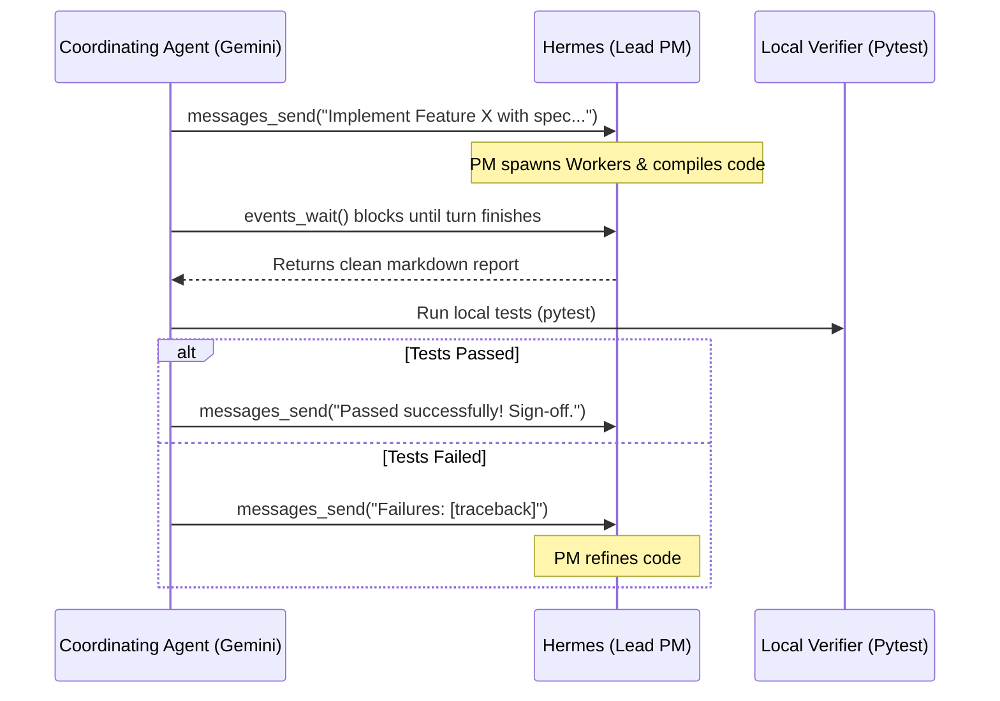

# Multi-Agent Coordination & MCP Delegation

This skill defines the workflows, protocols, and technical integrations for coordinating complex development and administrative tasks between **Hermes Agent** and external coordinating or client agents (such as Google DeepMind's Gemini/Antigravity, Anthropic's Claude Code, or Cursor) using the built-in **Model Context Protocol (MCP)**.

---

## 1. Trigger Conditions

Use this skill when:
- Designing or troubleshooting a multi-agent harness or collaborative workspace.
- Setting up Hermes to run as an MCP server so that other coding assistants can delegate work to it.
- Implementing an outer test-driven loop (TDD) where an orchestrator agent directs a workspace-bound Hermes instance.
- Dealing with agent-to-agent message formatting, event polling, or security auto-approvals over MCP.

---

## 2. Key Architecture: Hierarchical Delegation

To maintain manageable context windows and optimize reasoning:
1. **Executive Coordinator (e.g. Gemini/Antigravity):** Manages the high-level system requirements, plans architecture, reviews implementation milestones, and executes verification tests. Employs Hermes via MCP for physical actions.
2. **Workspace Lead PM (Hermes MCP Server):** Receives high-level directives. Outlines plans, manages modules, merges implementations, and coordinates sub-tasks.
3. **Task Workers (Hermes Subagents):** Ephemeral, short-lived leaf agents spawned by the Hermes PM using `delegate_task` to handle single focus domains (e.g., Doc Research, Feature Coding, QA/Tests writing) without polluting the main PM's token history.

---

## 3. The Out-of-the-Box Hermes MCP Server

Run Hermes as an MCP server with the command:
```bash
hermes mcp serve
```

This exposes **10 messaging and session tools** matching the standard channel bridge:

- `conversations_list`: Lists active chat routes with their `session_key` and `session_id`.
- `conversation_get`: Retrieves metadata and token metrics.
- `messages_read`: Chronic message history (fetch clean assistant output).
- `attachments_fetch`: Extracts images/media.
- `events_poll` / `events_wait`: Polls or blocks (long-polls) until Hermes has finished its turn or requested approval.
- `messages_send`: Injects prompt instructions to a Hermes session.
- `channels_list`: Lists platforms and chats.
- `permissions_list_open` / `permissions_respond`: Polls and dynamically resolves (allows/denies) security-gated shell actions.

---

## 4. Key Workflows & Code Patterns

### Standard Outer TDD Orchestration Loop (Harness)
An external script or coordinator runs a loop checking test suites, capturing stack traces, and passing fixes back to Hermes:



### Event Long-Polling & Auto-Approval Code
When coordinating via stdio MCP, write a background parser that handles real-time events and auto-approves linter or shell tools so the worker never blocks:

```python
# Block-wait for events
wait_res_str = mcp_client.call_tool("events_wait", {
    "after_cursor": last_cursor,
    "session_key": target_session,
    "timeout_ms": 30000
})
wait_res = json.loads(wait_res_str)
event = wait_res.get("event")

if event:
    last_cursor = max(last_cursor, event.get("cursor", 0))
    event_type = event.get("type")
    
    # Handle auto-approvals
    if event_type == "approval_requested":
        approval_id = event.get("approval_id") or event.get("data", {}).get("approval_id")
        if approval_id:
            mcp_client.call_tool("permissions_respond", {
                "id": approval_id,
                "decision": "allow-once"
            })
```

---

## 5. Pitfalls & Lessons Learned

### ⚠️ Markdown Corruption via `clean_output`
- **Pitfall:** Running terminal cleanup/stripping filters on messages read from MCP. Terminal-focused regex filters (which look for TUI boxes `│`, em-dashes `───`, etc.) will mangle valid markdown tables, lists, and horizontal dividers generated by the model.
- **Rule:** **Never** run CLI-specific "TUI wrappers cleanup" on output retrieved via `messages_read` or `events_wait`. That data is already clean markdown read directly from the SQLite database. Only apply TUI cleaners when parsing stdout from a direct CLI subprocess execution.

### ⚠️ Windows Path and User Portability
- **Pitfall:** Hardcoding active paths like `C:\Users\admin\...` into python scripts or workspace definitions causes immediate crashes when ported to a different host or pipeline.
- **Rule:** Dynamically resolve standard paths using environment variables first, falling back to static pathways only as safety checks:
  ```python
  appdata = os.environ.get("LOCALAPPDATA", r"C:\Users\admin\AppData\Local")
  workspace = os.environ.get("USERPROFILE", r"C:\Users\admin")
  ```

### ⚠️ Missing Active Channels on Clean Installs
- **Pitfall:** Attempting to fetch `conversations_list` on a completely clean/new environment can return an empty list, causing a client-side target resolution crash.
- **Rule:** Fall back gracefully. If `conversations_list` is empty, query `channels_list` to fetch active platforms. If that is also empty, automatically spin down the MCP transport and activate a fallback CLI subprocess conversation (`hermes chat`) to kickstart a local session.

---

## 6. Associated Reference Files
* [HAM-TDD MCP Payloads & Integration Specs](references/ham-tdd-mcp-payloads.md) — Detailed JSON-RPC request-response payloads, Win32-specific terminal hacks, and bug-avoidance configurations.
